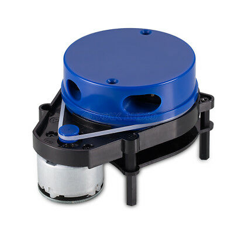

# YDLidar X4

- 360-degree scanning rangefinder
- 5000 times/sec sampling rates
- 10-meter scanning range
- Clockwise 360-degree rotary ranging module


# Lidar point data structure


Parameters
=====================================================================
port (string, default: /dev/ydlidar)

    serial port name used in your system.

baudrate (int, default: 115200)

    serial port baud rate.

frame_id (string, default: laser_frame)

    frame ID for the device.

low_exposure (low_exposure, default: false)

    indicated whether the LIDAR has low light power mode.

reversion (bool, default: false)

    indicated whether the LIDAR IS reversion.

resolution_fixed (bool, default: true)

    indicated whether the LIDAR has a fixed angular resolution.

angle_min (double, default: -180)

    Min valid angle (°) for LIDAR data.

angle_max (double, default: 180)

    Max valid angle (°) for LIDAR data.

range_min (double, default: 0.08)

    Min valid range (m) for LIDAR data.

range_max (double, default: 16.0)

    Max valid range (m) for LIDAR data.

ignore_array (string, default: "")

    Set the current angle range value to zero.

samp_rate (int, default: 4)

    the LIDAR sampling frequency.

frequency (double, default: 7)

    the LIDAR scanning frequency.

data structure:

```c
	struct node_info {
    	uint8_t    sync_flag;
    	uint16_t   sync_quality;//!信号质量
    	uint16_t   angle_q6_checkbit; //!测距点角度
    	uint16_t   distance_q2; //! 当前测距点距离
    	uint64_t   stamp; //! 时间戳
    	uint8_t    scan_frequence;//! 特定版本此值才有效,无效值是0, 当前扫描频率current_frequence = scan_frequence/10.0
	} __attribute__((packed)) ;
```

example:

###note:current_frequence = data[0].scan_frequence/10.0.

###if the current_frequence value equals zero, it is an invalid value.

```c++

	if(data[i].scan_frequence != 0) {
 		current_frequence = data[i].scan_frequence/10.0;
	}

	current_time_stamp = data[i].stamp;

	 if(m_isMultipleRate) {
		current_distance = (float)data[i].distance_q2/2000.f;
	}else {
		current_distance = (float)data[i].distance_q2/4000.f;
	}

	current_angle = ((data[i].angle_q6_checkbit>>LIDAR_RESP_MEASUREMENT_ANGLE_SHIFT)/64.0f);

	current_intensity = (float)(data[i].sync_quality >> LIDAR_RESP_MEASUREMENT_QUALITY_SHIFT);


        void ParseScan(node_info* data, const size_t& size) {

            double current_frequence, current_distance, current_angle, current_intensity;

            uint64_t current_time_stamp;

            for (size_t i = 0; i < size; i++ ) {

                if( data[i].scan_frequence != 0) {

                    current_frequence =  data[i].scan_frequence;//or current_frequence = data[0].scan_frequence

                }

		 if(m_isMultipleRate) {
			current_distance = (float)data[i].distance_q2/2000.f;
		}else {
			current_distance = (float)data[i].distance_q2/4000.f;
		}

                current_angle = ((data[i].angle_q6_checkbit>>LIDAR_RESP_MEASUREMENT_ANGLE_SHIFT)/64.0f);//LIDAR_RESP_MEASUREMENT_ANGLE_SHIFT equals 8

                current_intensity = (float)(data[i].sync_quality >> LIDAR_RESP_MEASUREMENT_QUALITY_SHIFT);

            }

            if (current_frequence != 0 ) {

                printf("current lidar scan frequency: %f\n", current_frequence);

            } else {

                printf("Current lidar does not support return scan frequency\n");

            }
        }


```


Upgrade Log
=====================================================================

2018-12-3 version:1.3.9

1.Optimized interface.

2.Getting Radar Port Lists.

2018-05-23 version:1.3.4

1.add automatic reconnection if there is an exception

2.add serial file lock.

2018-05-14 version:1.3.3

   1.add the heart function constraint.

   2.add packet type with scan frequency support.

2018-04-16 version:1.3.2

   1.add multithreading support.

2018-04-16 version:1.3.1

   1.Compensate for each laser point timestamp.
