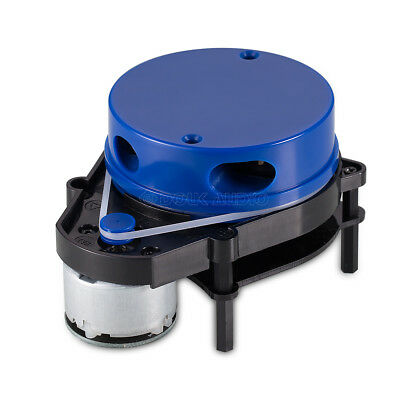

# YDLIDAR C++

Visit EAI Website for more details about [YDLIDAR](http://www.ydlidar.com/).

I pulled this from the official driver which is ROS based. There is **no license**
information in the `github` repo, so I assume I can use whatever I want.

# Docs

[here](docs)

# Specs

- 360-degree scanning rangefinder
- 5000 times/sec sampling rates
- 10-meter scanning range
- Clockwise 360-degree rotary ranging module

# Ubuntu Serial Access

```
$ sudo nano /etc/udev/rules.d/50-usb-serial.rules
```

And in the file that is opened by the GEdit, write these words:

```
KERNEL=="ttyUSB0", GROUP="kevin", MODE="0666"
```

Run this command: `sudo service udev restart`, but I did not run this command
and it worked, too.

# MIT License

## Copyright (c) 2019 Kevin J. Walchko

Permission is hereby granted, free of charge, to any person obtaining a copy
of this software and associated documentation files (the "Software"), to deal
in the Software without restriction, including without limitation the rights
to use, copy, modify, merge, publish, distribute, sublicense, and/or sell
copies of the Software, and to permit persons to whom the Software is
furnished to do so, subject to the following conditions:

The above copyright notice and this permission notice shall be included in all
copies or substantial portions of the Software.

THE SOFTWARE IS PROVIDED "AS IS", WITHOUT WARRANTY OF ANY KIND, EXPRESS OR
IMPLIED, INCLUDING BUT NOT LIMITED TO THE WARRANTIES OF MERCHANTABILITY,
FITNESS FOR A PARTICULAR PURPOSE AND NONINFRINGEMENT. IN NO EVENT SHALL THE
AUTHORS OR COPYRIGHT HOLDERS BE LIABLE FOR ANY CLAIM, DAMAGES OR OTHER
LIABILITY, WHETHER IN AN ACTION OF CONTRACT, TORT OR OTHERWISE, ARISING FROM,
OUT OF OR IN CONNECTION WITH THE SOFTWARE OR THE USE OR OTHER DEALINGS IN THE
SOFTWARE.
